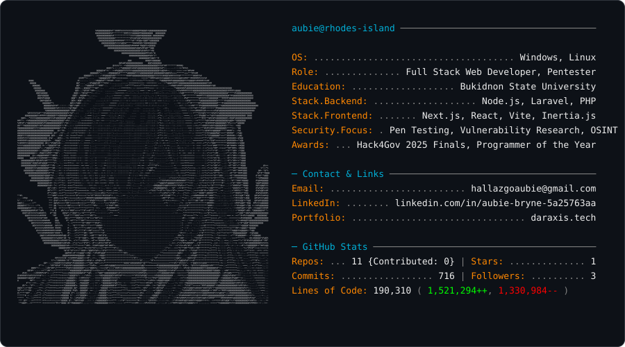

  <picture>
    <source media="(prefers-color-scheme: dark)" srcset="dark_mode.svg">
    <source media="(prefers-color-scheme: light)" srcset="light_mode.svg">
    
  </picture>

  
  

 

  

## 🛠️ Tech Stack & Skills

**Backend & Architecture**
* Laravel (v10 & v11)
* PHP
* RESTful APIs

**Frontend Ecosystem**
* React & Vite
* Inertia.js
* Material UI (MUI)

**Cybersecurity**
* Web Exploitation & Reverse Engineering
* Digital Forensics & CTF Competitions
* Penetration Testing & Vulnerability Research
* Security Auditing 
* OSINT